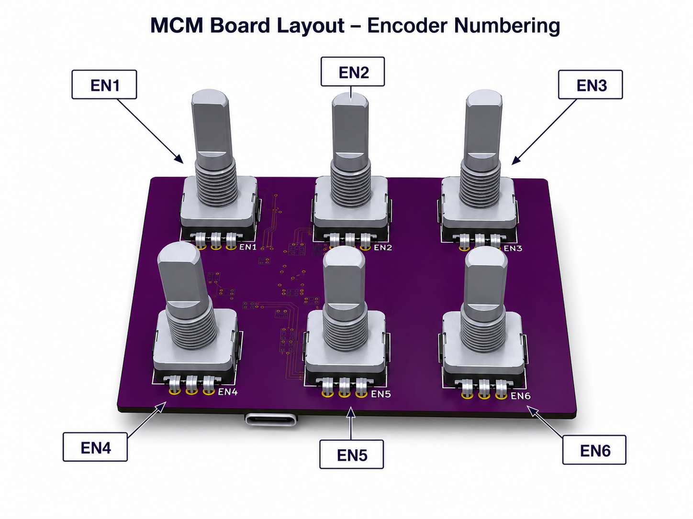
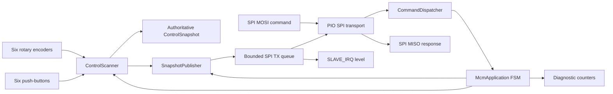

# Roth Amplification Modular Control Module Firmware

Firmware and protocol work for the **Roth Amplification Modular Control Module
(MCM)**, an RP2040-based six-encoder control surface intended to operate as an
SPI peripheral for a separate host controller.

> **Canonical firmware target:** `src/MCM_Firmware/MCM_Firmware.ino`. The older
> transport experiments and Layer-A/Layer-D integration sketches are preserved
> under `archive/pre-misra-canonicalization/` for history, but they are not
> production build targets.

## What the MCM is

The MCM board provides six Bourns PEC11L rotary encoders, each with an
integrated push-button, and an RP2040 that scans those controls and reports
authoritative state to a master MCU. The released board uses **SPI only** for
the external host interface. It does not expose an I²C host bus.



## Firmware engineering profile

The canonical native firmware follows a documented **MISRA C++:2023-inspired
deterministic embedded profile**:

- one cooperative application superloop;
- explicit application, button, snapshot, and receive-frame states;
- no project-owned dynamic allocation;
- no Arduino `String`, STL dynamic containers, exceptions, RTTI, or recursion;
- fixed-width integer types and scoped enumerations;
- compile-time pin, packet, queue, and resource assertions;
- bounded control scanning and packet publication work per loop iteration;
- fixed-capacity queues with checked failure returns;
- immutable six-encoder/six-button snapshot capture;
- CRC-protected fixed-length SPI packets;
- diagnostic counters and deterministic RESYNC recovery;
- a documented adopted-code boundary around Arduino-Pico and the Pico SDK.

This repository does **not** claim formal MISRA compliance yet. See
[MISRA-like Native-Code Profile](docs/MISRA_LIKE_PROFILE.md),
[Determinism and State Machines](docs/DETERMINISM.md), and
[Compliance Matrix](docs/MISRA_COMPLIANCE_MATRIX.md).

## Hardware at a glance

All external logic is 3.3 V.

| Signal | RP2040 GPIO | Direction | Notes |
|---|---:|---|---|
| `SLAVE_IRQ` | 11 | MCM → master | Active-high, level-based data-ready signal |
| `SPI_SCK` | 12 | Master → MCM | SPI Mode 0 clock, idle low |
| `SPI_CS` | 13 | Master → MCM | Active low; one protocol packet per assertion |
| `SPI_MISO` | 14 | MCM → master | State and response data |
| `SPI_MOSI` | 15 | Master → MCM | Commands and dummy read bytes |

The board's internal QSPI flash wiring is unrelated to the external host SPI
connector. See [Hardware and Control Map](docs/HARDWARE.md) for every encoder
phase and push-button GPIO.

## Control numbering

Packet indexes are zero-based while KiCad references are one-based:

```text
EN1 / index 0    EN2 / index 1    EN3 / index 2
EN4 / index 3    EN5 / index 4    EN6 / index 5
```

## Packet at a glance

Every host transaction is one fixed eight-byte packet:

| Byte | Field | Meaning |
|---:|---|---|
| 0 | `SYNC` | `0xA5` |
| 1 | `VERSION` | currently `0x01` |
| 2 | `TYPE` | command or response ID |
| 3 | `INDEX` | control index or type-specific count |
| 4 | `DATA0` | payload, least-significant byte |
| 5 | `DATA1` | payload |
| 6 | `DATA2` | payload, most-significant byte |
| 7 | `CRC8` | CRC-8 over bytes 0–6, polynomial `0x07` |

The canonical firmware implements six signed 24-bit encoder-state values and a
single button-state packet containing current-pressed and current-long-held
bitmaps. A coherent snapshot is nine packets:

```text
SNAPSHOT_BEGIN
ENCODER_STATE EN1
ENCODER_STATE EN2
ENCODER_STATE EN3
ENCODER_STATE EN4
ENCODER_STATE EN5
ENCODER_STATE EN6
BUTTON_STATE
SNAPSHOT_END
```

See [SPI Wire Protocol](docs/SPI_PROTOCOL.md) and
[Encoder and Button Model](docs/ENCODERS_AND_BUTTONS.md).

## Canonical architecture



The application is a deterministic cooperative superloop containing explicit
subordinate finite-state machines. It is soft real-time until measured
worst-case execution and maximum SPI timing bounds are published.

## Documentation map

Start here:

- [Documentation Index](docs/README.md)
- [Current Repository Status](docs/CURRENT_STATUS.md)
- [Repository Layout](docs/REPOSITORY_LAYOUT.md)
- [Architecture](docs/ARCHITECTURE.md)
- [Determinism and State Machines](docs/DETERMINISM.md)
- [MISRA-like Native-Code Profile](docs/MISRA_LIKE_PROFILE.md)
- [MISRA-like Compliance Matrix](docs/MISRA_COMPLIANCE_MATRIX.md)
- [Deviation and Adopted-Code Register](docs/MISRA_DEVIATIONS.md)
- [Hardware and Control Map](docs/HARDWARE.md)
- [SPI Wire Protocol](docs/SPI_PROTOCOL.md)
- [Encoder and Button Model](docs/ENCODERS_AND_BUTTONS.md)
- [PIO Implementation](docs/PIO_IMPLEMENTATION.md)
- [Build and Flash Guide](docs/BUILD_AND_FLASH.md)
- [Master Integration Guide](docs/MASTER_INTEGRATION.md)
- [Debugging and Logic Analyzer Guide](docs/DEBUGGING.md)
- [Known Limitations](docs/KNOWN_LIMITATIONS.md)
- [Implementation Roadmap](docs/IMPLEMENTATION_ROADMAP.md)
- [Maintainer Checklist](docs/MAINTAINER_CHECKLIST.md)
- [Glossary](docs/GLOSSARY.md)
- [Architectural Decision Records](docs/decisions/README.md)

## Source trees

| Path | Role | Status |
|---|---|---|
| `src/MCM_Firmware/` | Canonical six-encoder/six-button deterministic firmware | Active build target |
| `archive/pre-misra-canonicalization/` | Previous root transport and historical nested sketches | Reference only; excluded from native-code conformance scope |

## Design rules

1. The current board's host interface is SPI-only.
2. One chip-select frame contains exactly eight bytes.
3. `SLAVE_IRQ` is level-based, not a pulse.
4. MCM owns authoritative absolute control state.
5. Packet indexes are zero-based; KiCad references are one-based.
6. Reserved fields transmit as zero unless a protocol revision defines them.
7. Unsupported versions, invalid sync bytes, and bad CRCs never change state.
8. A snapshot is captured immutably before serialization and never interleaves.
9. Every bounded-queue failure is checked and forces deterministic recovery.
10. Native code uses no dynamic allocation and runs from one execution context.
11. PIO, Arduino-Pico, and Pico SDK code are treated as adopted/generated code.
12. Formal MISRA compliance must never be claimed without the required evidence.

## Local checks

```bash
python3 tools/check_license_headers.py
python3 tools/check_misra_like.py
bash tests/host/run.sh
```

## Toolchain

The project targets the Earle Philhower **Arduino-Pico** core for RP2040. See
[Build and Flash Guide](docs/BUILD_AND_FLASH.md) for project-specific setup and
upload instructions.

## License

MCM firmware is licensed under the **Mozilla Public License 2.0** (`MPL-2.0`).
MPL-2.0 is file-level copyleft: distributed modifications to MPL-covered files
remain open under MPL-2.0, while separate files in a larger commercial product
may use other terms. See [`LICENSE`](LICENSE), [`NOTICE`](NOTICE), and
[MCM Firmware Licensing](docs/LICENSING.md).

The firmware license does not grant rights to Roth Amplification trademarks or
automatically license separate PCB, schematic, mechanical, or branding assets.
