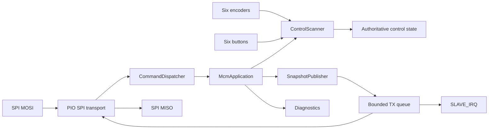

# Roth Amplification Modular Control Module Firmware

Firmware for the **Roth Amplification Modular Control Module (MCM)**, an
RP2040-based six-encoder control surface that operates as an SPI peripheral for
a separate host controller.

The active Arduino-Pico sketch is:

```text
src/MCM_Firmware/MCM_Firmware.ino
```

## Hardware

The MCM provides six Bourns PEC11L rotary encoders with integrated push-buttons.
The board uses a 3.3 V, SPI-only host interface.

| Signal | RP2040 GPIO | Direction | Notes |
|---|---:|---|---|
| `SLAVE_IRQ` | 11 | MCM → host | Active-high, level-based data-ready signal |
| `SPI_SCK` | 12 | Host → MCM | SPI Mode 0 clock |
| `SPI_CS` | 13 | Host → MCM | Active low; one packet per assertion |
| `SPI_MISO` | 14 | MCM → host | State and response data |
| `SPI_MOSI` | 15 | Host → MCM | Commands and dummy read bytes |

Control numbering is fixed:

```text
EN1 / index 0    EN2 / index 1    EN3 / index 2
EN4 / index 3    EN5 / index 4    EN6 / index 5
```

See [Hardware and Control Map](docs/HARDWARE.md) for the complete GPIO map.

## Firmware architecture

The firmware is a deterministic cooperative embedded system composed of
explicit state machines and bounded queues.



The project-owned firmware uses:

- fixed-width integer types;
- scoped enumerations;
- fixed-capacity queues;
- checked error returns;
- immutable snapshot capture;
- no project-owned dynamic allocation;
- no Arduino `String`;
- no dynamic STL containers;
- no exceptions, RTTI, or recursion;
- bounded work per normal loop iteration;
- explicit recovery through `RESYNC`.

The native firmware follows a documented MISRA C++:2023-inspired engineering
profile. The repository does **not** claim formal MISRA compliance or safety
certification. See [Firmware Engineering Profile](docs/MISRA_LIKE_PROFILE.md)
and [Determinism and State Machines](docs/DETERMINISM.md).

## SPI protocol

Each chip-select frame contains exactly one eight-byte packet:

| Byte | Field | Meaning |
|---:|---|---|
| 0 | `SYNC` | `0xA5` |
| 1 | `VERSION` | Protocol version |
| 2 | `TYPE` | Command or response type |
| 3 | `INDEX` | Control index or type-specific count |
| 4 | `DATA0` | Payload, least-significant byte |
| 5 | `DATA1` | Payload |
| 6 | `DATA2` | Payload, most-significant byte |
| 7 | `CRC8` | CRC-8 over bytes 0–6, polynomial `0x07` |

A complete state snapshot is nine packets:

```text
SNAPSHOT_BEGIN
ENCODER_STATE EN1
ENCODER_STATE EN2
ENCODER_STATE EN3
ENCODER_STATE EN4
ENCODER_STATE EN5
ENCODER_STATE EN6
BUTTON_STATE
SNAPSHOT_END
```

See [SPI Wire Protocol](docs/SPI_PROTOCOL.md) and
[Master Integration](docs/MASTER_INTEGRATION.md).

## Repository layout

```text
src/MCM_Firmware/     Active firmware
tests/host/           Host-side protocol and state-machine tests
tools/                Source-policy and licensing checks
docs/                 Engineering documentation
archive/              Legacy reference source; not a build target
```

## Build and test

Run the project checks:

```bash
python3 tools/check_license_headers.py
python3 tools/check_misra_like.py
bash tests/host/run.sh
```

Build and upload `src/MCM_Firmware/MCM_Firmware.ino` using the Earle Philhower
Arduino-Pico core. Detailed instructions are in
[Build and Flash](docs/BUILD_AND_FLASH.md).

## Documentation

- [Documentation Index](docs/README.md)
- [Current Status](docs/CURRENT_STATUS.md)
- [Architecture](docs/ARCHITECTURE.md)
- [Determinism and State Machines](docs/DETERMINISM.md)
- [Firmware Engineering Profile](docs/MISRA_LIKE_PROFILE.md)
- [Hardware and Control Map](docs/HARDWARE.md)
- [SPI Wire Protocol](docs/SPI_PROTOCOL.md)
- [Encoder and Button Model](docs/ENCODERS_AND_BUTTONS.md)
- [Build and Flash](docs/BUILD_AND_FLASH.md)
- [Master Integration](docs/MASTER_INTEGRATION.md)
- [Debugging](docs/DEBUGGING.md)
- [Known Limitations](docs/KNOWN_LIMITATIONS.md)
- [Implementation Roadmap](docs/IMPLEMENTATION_ROADMAP.md)
- [Maintainer Checklist](docs/MAINTAINER_CHECKLIST.md)
- [Architectural Decision Records](docs/decisions/README.md)

## License

MCM firmware is licensed under the **Mozilla Public License 2.0**
(`MPL-2.0`). Distributed modifications to MPL-covered files remain under
MPL-2.0, while separate files in a larger product may use other terms.

See [`LICENSE`](LICENSE), [`NOTICE`](NOTICE), and
[Firmware Licensing](docs/LICENSING.md). The firmware license does not grant
rights to Roth Amplification trademarks or automatically license separate PCB,
schematic, mechanical, or branding assets.
