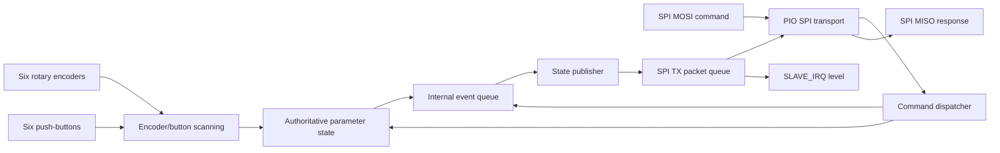

# Roth Amplification Modular Control Module Firmware

Firmware and protocol work for the **Roth Amplification Modular Control Module (MCM)**, an RP2040-based six-encoder control surface intended to operate as an SPI peripheral for a separate host controller.

> **Repository status:** this repository contains valuable working transport and protocol layers, but the current `main` branch is not yet a single clean, build-complete production firmware tree. The newer top-level SPI sketch references support headers that were moved into a nested historical sketch directory, while the nested directory contains more than one `.ino` entry point. Read [Current Repository Status](docs/CURRENT_STATUS.md) before attempting to build.

## What the MCM is

The MCM board provides six Bourns PEC11L rotary encoders, each with an integrated push-button, and an RP2040 that scans those controls and reports authoritative state to a master MCU. The released board uses **SPI only** for the external host interface. It does not expose an I²C host bus.

## Hardware at a glance

All external logic is 3.3 V.

| Signal | RP2040 GPIO | Direction | Notes |
|---|---:|---|---|
| `SLAVE_IRQ` | 11 | MCM → master | Active-high, level-based data-ready signal |
| `SPI_SCK` | 12 | Master → MCM | SPI Mode 0 clock, idle low |
| `SPI_CS` | 13 | Master → MCM | Active low; one protocol packet per assertion |
| `SPI_MISO` | 14 | MCM → master | State and response data |
| `SPI_MOSI` | 15 | Master → MCM | Commands and dummy read bytes |

The board's internal QSPI flash wiring is unrelated to the external host SPI connector.

See [Hardware and Control Map](docs/HARDWARE.md) for every encoder phase and push-button GPIO.

## Packet at a glance

Every host transaction is one fixed eight-byte packet:

| Byte | Field | Meaning |
|---:|---|---|
| 0 | `SYNC` | `0xA5` |
| 1 | `VERSION` | currently `0x01` |
| 2 | `TYPE` | command or response ID |
| 3 | `INDEX` | parameter/control index or type-specific count |
| 4 | `DATA0` | payload, least-significant byte |
| 5 | `DATA1` | payload |
| 6 | `DATA2` | payload, most-significant byte |
| 7 | `CRC8` | CRC-8 over bytes 0–6, polynomial `0x07` |

The implemented parameter value is a little-endian signed or unsigned 24-bit payload depending on the active firmware profile. The current code does not yet connect all six physical encoders and six buttons to this packet stream. See [SPI Wire Protocol](docs/SPI_PROTOCOL.md) and [Encoder and Button Model](docs/ENCODERS_AND_BUTTONS.md).

## Architecture

The architecture deliberately separates physical scanning, state ownership, event generation, packet serialization, and the SPI electrical transport. The separation is sound even though the repository still needs consolidation into one canonical sketch.

## Documentation map

Start here:

- [Documentation Index](docs/README.md)
- [Current Repository Status](docs/CURRENT_STATUS.md)
- [Architecture](docs/ARCHITECTURE.md)
- [Hardware and Control Map](docs/HARDWARE.md)
- [SPI Wire Protocol](docs/SPI_PROTOCOL.md)
- [Encoder and Button Model](docs/ENCODERS_AND_BUTTONS.md)
- [PIO Implementation](docs/PIO_IMPLEMENTATION.md)
- [Build and Flash Guide](docs/BUILD_AND_FLASH.md)
- [Master Integration Guide](docs/MASTER_INTEGRATION.md)
- [Debugging and Logic Analyzer Guide](docs/DEBUGGING.md)
- [Known Limitations](docs/KNOWN_LIMITATIONS.md)
- [Implementation Roadmap](docs/IMPLEMENTATION_ROADMAP.md)
- [Maintainer Checklist](docs/MAINTAINER_CHECKLIST.md)
- [Glossary](docs/GLOSSARY.md)
- [Architectural Decision Records](docs/decisions/README.md)

## Source trees currently present

| Path | Role | Status |
|---|---|---|
| `src/Modular_Control_Module_PIO_SPI.ino` | Newer hardware-aligned SPI sketch | Incomplete because several included support headers are absent from `src/` |
| `src/TransportSPI.*`, `src/SpiSlaveM0.pio`, `src/HardwareConfig.h` | Newer hardware-aligned SPI transport | Best current reference for corrected SPI GPIO/PIO configuration |
| `src/Modular_Control_Module_PIO_SPI_LAYER_A_RX/` | Older integrated protocol/transport layer | Contains more complete modules, but is a historical mixed sketch folder and requires cleanup before treating it as canonical |

See [Repository Layout](docs/REPOSITORY_LAYOUT.md) for a file-by-file explanation.

## Design rules

1. The current board's host interface is SPI-only.
2. One chip-select frame always contains exactly eight bytes.
3. `SLAVE_IRQ` is level-based, not a pulse.
4. Parameter state is authoritative on the MCM; the master consumes absolute state rather than raw electrical edges.
5. Packet indexes are zero-based while KiCad references are one-based.
6. Reserved fields transmit as zero.
7. Unsupported versions, invalid sync bytes, and bad CRCs are discarded without changing state.
8. A coherent snapshot must never interleave with another snapshot.
9. Documentation must distinguish implemented behavior from proposed behavior.

## Toolchain

The project targets the Earle Philhower **Arduino-Pico** core for RP2040. Current installation and upload instructions are maintained by the Arduino-Pico project; see [Build and Flash Guide](docs/BUILD_AND_FLASH.md) for the project-specific steps and links.

## License

MCM firmware is licensed under the **Mozilla Public License 2.0**
(`MPL-2.0`). MPL-2.0 is file-level copyleft: distributed modifications to
MPL-covered files remain open under MPL-2.0, while separate files in a larger
commercial product may use other terms. See [`LICENSE`](LICENSE),
[`NOTICE`](NOTICE), and [MCM Firmware Licensing](docs/LICENSING.md).

The firmware license does not grant rights to Roth Amplification trademarks or
automatically license separate PCB, schematic, mechanical, or branding assets.
