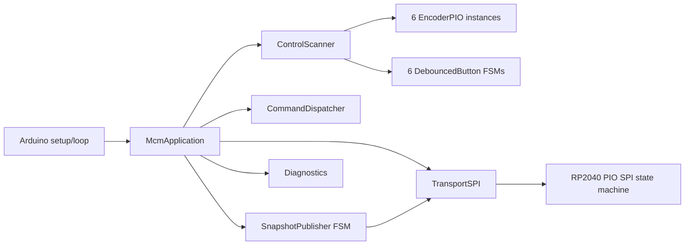

# MCM Firmware Architecture

## Architectural style

The canonical firmware is a cooperative event-driven embedded application with
explicit subordinate finite-state machines. It uses no RTOS and no
project-owned dynamic allocation.



## Ownership

| State | Sole owner |
|---|---|
| Encoder transition counts | `EncoderPIO` instances |
| Authoritative encoder/button state | `ControlScanner` |
| Frozen snapshot being serialized | `SnapshotPublisher` |
| Pending incremental publications | `SnapshotPublisher` queue |
| SPI TX packets and RX assembly | `TransportSPI` |
| Recovery mode and snapshot sequence | `McmApplication` |
| Error counters | `Diagnostics` |

No queue or mutable application object is designed for concurrent ISR/core-1
access.

## Main loop order

`McmApplication::service()` performs the same ordered stages each iteration:

1. service SPI RX/TX FIFOs;
2. consume at most one complete host command;
3. scan all six encoders and buttons;
4. queue changed absolute states;
5. advance publication by at most one packet;
6. offer at most one packet to the SPI TX queue;
7. transition from recovery to running when all recovery data is consumed.

## Recovery invariant

A queue-integrity failure or host `RESYNC` command causes:

```text
clear SPI TX state
clear publisher events and partial snapshot
increment resync counter
capture one new immutable control snapshot
serialize BEGIN + six encoders + buttons + END
remain Resynchronizing until publisher and transport are idle
```

Stale events are never intentionally mixed into the new baseline.

## Memory model

All persistent objects are statically allocated. Arrays and queues have
compile-time capacities. The project code uses no ownership pointers, dynamic
containers, or runtime object graphs.

## Hardware/software split

PIO owns SPI edge timing and encoder phase-change capture. C++ owns packet
framing, state validation, control semantics, queues, recovery, and diagnostics.
The PIO sources and generated headers are treated as separately reviewed
adopted/generated code for compliance purposes.
