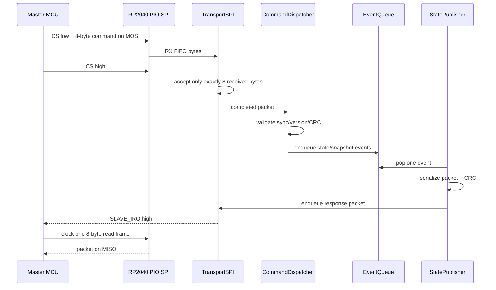

# Firmware Architecture

## Design objective

The MCM owns physical control state and exposes deterministic, versioned state to a master MCU. The master should not need to decode switch bounce or raw quadrature transitions.

## Layer model

### 1. Hardware definition

`HardwareConfig.h` and the future `ControlMap.h` are the only intended sources of GPIO truth. PIO programs and integration code must agree with these values.

### 2. Physical control scanning

- `EncoderPIO` converts electrical quadrature states into a monotonic transition count.
- `DebouncedButton` converts an active-low switch into stable pressed/released state plus one-shot edges.

These modules currently exist but are not instantiated by the active integration sketch.

### 3. Authoritative parameter model

`Param` stores the current value, default, range, step metadata, and wrap policy. The current implementation only uses reset-to-default behavior; range, step, and wrap metadata are placeholders for the later control-binding layer.

### 4. Internal event queue

`EventQueue<N>` decouples state changes from packet serialization. Producers append compact `Event` records. `StatePublisher` consumes them one at a time.

The queue is single-threaded. It has no interrupt locking, atomics, or multicore synchronization. All accesses must occur from one execution context unless explicit synchronization is added.

### 5. Command dispatcher

`CommandDispatcher` validates sync, version, and CRC before applying a command. Reset commands mutate the parameter array and enqueue the resulting authoritative state. Snapshot commands enqueue begin/state/end events.

### 6. State publisher

`StatePublisher` converts one internal event into one fixed packet and computes its CRC. It contains one staging packet. The main loop must move that packet into `TransportSPI` before another event can be serialized.

### 7. SPI transport

`TransportSPI` owns:

- RP2040 PIO configuration;
- CS-framed receive assembly;
- one completed RX packet slot;
- an eight-packet software TX ring;
- the active-high IRQ output;
- transfer of bytes between software and PIO FIFOs.

It deliberately does not interpret packet types or CRCs.

## End-to-end command path



## State ownership

The parameter array is authoritative. Packet transmission is a report of state, not the state itself. Clearing a transport queue must never roll back a parameter value.

## Snapshot invariant

A snapshot is ordered:

```text
BEGIN -> state records -> END
```

No second snapshot may begin before the first snapshot's END has entered the ordered outbound stream. For the stronger coherent snapshot design, all encoder and button state must first be copied into an immutable temporary buffer.

## Main-loop service requirements

The main loop must call `TransportSPI::service()` frequently enough to drain RX FIFO data and supply TX FIFO data. It must also move publisher packets into the transport queue without blocking.

No existing layer performs scheduling, deadlines, or watchdog handling. Those belong in the production integration layer.

## Error strategy

- Bad sync/version/CRC: discard packet and make no state change.
- Partial CS frame: discard.
- RX overrun beyond eight bytes: ignore extra bytes until CS rises.
- Event queue full: current code silently loses the event; production code must count/report this.
- TX queue full: current caller may silently lose the newest packet; production code must count/report this.
- Lost synchronization: master issues `RESYNC`, then accepts only a fresh framed snapshot.
